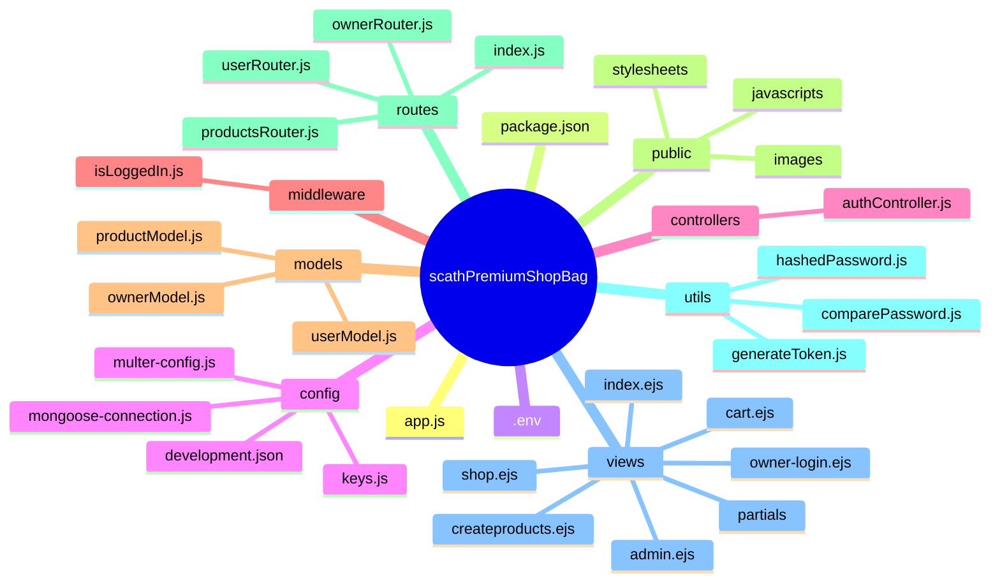

## Folder and File Logic Explained

### Root Files
- **app.js**: Initializes the Express application, sets up middleware, connects to MongoDB, and registers all routers. This is the main entry point of the backend.
- **package.json**: Lists project dependencies, scripts, and metadata. Used by npm to manage packages and run scripts.
- **.env**: Stores sensitive environment variables (like database URIs and secrets) outside of source code.

### config/
- **development.json**: Contains environment-specific configuration (e.g., database URIs for development).
- **keys.js**: Stores secret keys or configuration values used throughout the app.
- **mongoose-connection.js**: Handles connecting to MongoDB using Mongoose. Ensures the database is ready before the app starts.
- **multer-config.js**: Configures Multer for handling file uploads (e.g., product images) in memory or on disk.

### controllers/
- **authController.js**: Contains logic for user registration, login, and logout. Handles password hashing, token generation, and user validation.

### middleware/
- **isLoggedIn.js**: Middleware to check if a user is authenticated before allowing access to protected routes. Used to secure admin or user-only pages.

### models/
- **ownerModel.js**: Defines the schema for store owners/admins, including credentials and products managed.
- **productModel.js**: Defines the schema for products, including name, image, price, discount, and color options.
- **userModel.js**: Defines the schema for users, including credentials, cart, orders, and profile info.

### public/
- **images/**: Stores product and user images accessible by the client.
- **javascripts/**: Client-side JavaScript files for dynamic frontend behavior.
- **stylesheets/**: CSS files for styling the frontend pages.

### routes/
- **index.js**: Handles general or landing page routes.
- **ownerRouter.js**: Handles owner/admin-specific routes, such as creating owners and accessing the admin dashboard.
- **productsRouter.js**: Handles product-related routes, such as creating and listing products. Integrates Multer for image uploads.
- **userRouter.js**: Handles user-related routes, including registration, login, and logout. Delegates logic to controllers.

### utils/
- **comparePassword.js**: Utility to compare a plain password with a hashed password (for login validation).
- **generateToken.js**: Utility to generate JWT tokens for authenticated sessions.
- **hashedPassword.js**: Utility to hash passwords securely before saving to the database.

### views/
- **admin.ejs**: EJS template for the admin dashboard.
- **cart.ejs**: EJS template for the shopping cart page.
- **createproducts.ejs**: EJS template for the product creation form.
- **index.ejs**: EJS template for the main landing page.
- **owner-login.ejs**: EJS template for the owner/admin login page.
- **shop.ejs**: EJS template for the main shop page.
- **partials/**: Contains reusable EJS template fragments (like headers, footers, navbars) included in other views.
## Folder Structure Mind Map



---

## Folder Explanations

- **app.js**: Main entry point, sets up Express app, middleware, routers, and connects to MongoDB.
- **package.json**: Project metadata, dependencies, and scripts.
- **.env**: Environment variables for sensitive data (DB URI, secrets).

- **config/**: Configuration files for database connection, keys, and file upload (Multer).
  - `mongoose-connection.js`: Connects to MongoDB using Mongoose.
  - `multer-config.js`: Sets up Multer for file uploads.
  - `development.json`, `keys.js`: Environment-specific and secret keys.

- **controllers/**: Contains business logic for handling requests.
  - `authController.js`: Handles user registration, login, and logout logic.

- **middleware/**: Custom Express middleware for request processing.
  - `isLoggedIn.js`: Checks if a user is authenticated before accessing protected routes.

- **models/**: Mongoose schemas for MongoDB collections.
  - `ownerModel.js`: Owner/admin schema.
  - `productModel.js`: Product schema.
  - `userModel.js`: User schema.

- **public/**: Static assets served to the client (images, CSS, JS).
  - `images/`, `javascripts/`, `stylesheets/`: Organize static files.

- **routes/**: Express routers for different parts of the app.
  - `index.js`: General routes.
  - `ownerRouter.js`: Owner/admin routes.
  - `productsRouter.js`: Product management routes.
  - `userRouter.js`: User authentication and profile routes.

- **utils/**: Utility/helper functions for common tasks.
  - `comparePassword.js`: Compares plain and hashed passwords.
  - `generateToken.js`: Generates JWT tokens.
  - `hashedPassword.js`: Hashes passwords securely.

- **views/**: EJS templates for server-side rendering.
  - `admin.ejs`, `cart.ejs`, `createproducts.ejs`, `index.ejs`, `owner-login.ejs`, `shop.ejs`: Rendered pages for different parts of the app.
  - `partials/`: Reusable EJS template fragments.

# Scath Premium Shop Bag

## Overview
Scath Premium Shop Bag is a modular Node.js e-commerce backend built with Express, MongoDB (Mongoose), and EJS. It supports user authentication, product management, and owner/admin features. The project is structured for scalability, maintainability, and clear separation of concerns.

---

## Project Architecture Diagram

```mermaid
graph TD
   A[Client (Browser)] -->|HTTP Requests| B[Express App (app.js)]
   B --> C[Middleware]
   C --> D[Router: /users]
   C --> E[Router: /owners]
   C --> F[Router: /products]
   C --> G[Router: /]
   D --> H[User Controller]
   E --> I[Owner Controller]
   F --> J[Product Controller]
   H --> K[User Model]
   I --> L[Owner Model]
   J --> M[Product Model]
   B --> N[MongoDB (via Mongoose)]
   B --> O[Views (EJS Templates)]
   B --> P[Static Files (Public)]
   B --> Q[Utils (Password, JWT, etc.)]
```

---

## Project Structure

```
scathPremiumShopBag/
│   app.js                # Main application entry point
│   package.json          # Project dependencies and scripts
│   .env                  # Environment variables
│
├── config/               # Configuration files (DB, keys, multer)
├── controllers/          # Route controllers (business logic)
├── middleware/           # Custom middleware (e.g., authentication)
├── models/               # Mongoose models (data schemas)
├── public/               # Static assets (images, JS, CSS)
├── routes/               # Express route handlers
├── utils/                # Utility functions (password, JWT, etc.)
└── views/                # EJS templates for server-side rendering
```

---

## Main Technologies

- **Node.js** & **Express**: Server, routing, and middleware
- **MongoDB** & **Mongoose**: Database and ODM
- **EJS**: Templating engine for SSR
- **Multer**: File uploads (product images)
- **JWT**: Authentication
- **bcrypt**: Password hashing
- **dotenv**: Environment variable management
- **connect-flash**: Flash messages
- **express-session**: Session management

---

## Detailed Control Flow & Features

### 1. App Initialization (`app.js`)
- Loads environment variables from `.env`.
- Connects to MongoDB using Mongoose (see `config/mongoose-connection.js`).
- Sets up middleware: cookie parser, session, flash, JSON parsing, static files.
- Registers routers for `/owners`, `/users`, `/products`, and `/` (index).

### 2. Middleware
- Handles cookies, sessions, flash messages, JSON and URL-encoded data, and serves static files.
- Ensures all requests pass through necessary authentication and parsing layers before reaching routers.

### 3. Routing & Controllers
- **/owners**: Owner/admin creation, admin dashboard, and owner-specific actions.
- **/users**: User registration, login, logout, and user-specific actions.
- **/products**: Product creation and management (with image upload via Multer).
- **/**: General/index routes.

### 4. Models
- **User Model**: Stores user credentials, profile, cart, and orders.
- **Owner Model**: Stores owner credentials, products managed, and admin status.
- **Product Model**: Stores product details (name, image, price, discount, colors, etc.).

### 5. Utilities
- **Password Hashing**: Securely hashes user passwords before saving.
- **Password Comparison**: Compares plain and hashed passwords for login.
- **JWT Generation**: Issues JWT tokens for authenticated sessions.

### 6. Views (EJS Templates)
- Renders dynamic HTML for admin, shop, cart, and other pages.
- Receives data from controllers and displays it to users.

### 7. Static Files
- All images, CSS, and client-side JS are served from the `public/` directory.

---

## Example Request Flow

1. **User Registration**
  - User submits registration form → `/users/register` (POST)
  - Controller validates input, hashes password, creates user in DB, issues JWT token, and sets cookie.

2. **User Login**
  - User submits login form → `/users/login` (POST)
  - Controller validates credentials, compares hashed password, issues JWT token, and sets cookie.

3. **Product Creation (Owner/Admin)**
  - Owner accesses `/owners/admin` → Fills product form → Submits to `/products/` (POST)
  - Image uploaded via Multer, product saved in DB, and confirmation rendered.

4. **Session & Authentication**
  - JWT tokens are stored in cookies for session management.
  - Middleware checks for valid tokens to protect routes.

---

## Environment Variables (`.env`)

- `MONGODB_URI`: MongoDB connection string
- `EXPRESS_SESSION_SECRET`: Session secret
- `JWT_SECRET`: JWT signing key

---

## How to Run

1. Install dependencies:
  ```bash
  npm install
  ```
2. Set up your `.env` file with required variables.
3. Start the server:
  ```bash
  npm start
  ```

---

## Notes

- Only one owner can be created (in development mode).
- Product images are stored in memory (can be extended for persistent storage).
- Modular structure for easy extension (add more routes, controllers, models as needed).
- All business logic is separated into controllers for maintainability.
- All sensitive data (passwords, tokens) is handled securely using industry best practices.

---

## License
MIT
